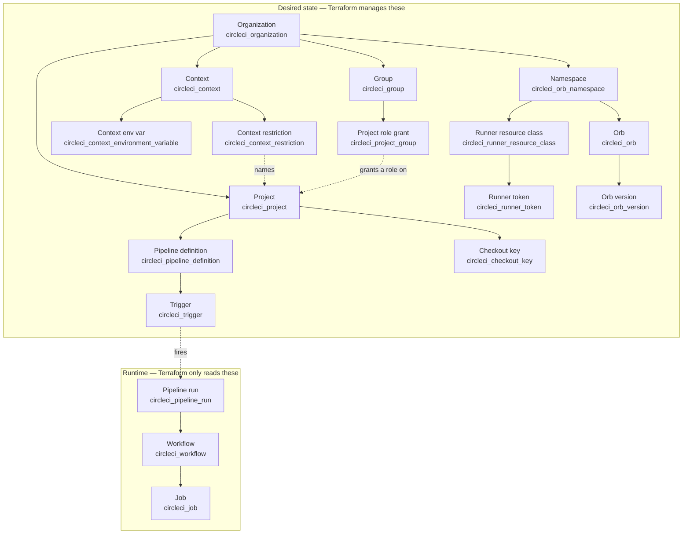

# How CircleCI's objects relate

The reference pages describe one type each. This page is the map they sit on: what
owns what, which identifier addresses which object, and which objects Terraform
manages as desired state versus only reads.

If you are starting from nothing, read [Getting started](./getting-started)
first — it walks the same objects in the order you have to create them.

## Start here: a definition is not a run

This is the single most common source of confusion with CircleCI's API, and the
reason six types in this provider were renamed. CircleCI's API has two different
things that a UUID can identify:

| Concept | Route | What it is |
|---|---|---|
| Pipeline **definition** | `/projects/{project_id}/pipeline-definitions` | Where to check out, where to find configuration, which config file |
| Pipeline **run** | `/pipeline/{id}` | One execution of a definition, which spawns workflows and jobs |

A definition is a *declaration*: this repository, this config file, this checkout
source. It is inert. A run is one *execution* of a definition, created by a
trigger firing (or by a human clicking, or by the API), and it is what spawns
workflows, which spawn jobs.

In everyday CircleCI usage "pipeline" means the **run**. That is why the
provider's definition resource is called `circleci_pipeline_definition` rather
than `circleci_pipeline` — the shorter, more familiar word was pointing at the
less familiar concept. Both UUIDs look identical, so nothing rejects the wrong
one at plan time; you find out when a trigger never fires or a data source
returns nothing.

| Reads or manages | Type | Takes |
|---|---|---|
| Definition | `circleci_pipeline_definition` (resource and data source) | `project_id` |
| Definitions in a project | `circleci_pipeline_definitions` (data source) | `project_id` |
| Run | `circleci_pipeline_run` (data source) | `id`, or `project_slug` + `number` |
| A run's config | `circleci_pipeline_run_config` (data source) | `run_id` |
| A run's parameter values | `circleci_pipeline_run_values` (data source) | `run_id` |
| A run's workflows | `circleci_pipeline_run_workflows` (data source) | `run_id` |

`circleci_trigger.pipeline_definition_id` is a **definition** id — the trigger
route is `/projects/{project_id}/pipeline-definitions/{id}/triggers`. Anything
named for a run takes a run id.

See [Renaming pipeline resources and data sources](./renaming-pipeline-types) for
the old names, what still works, and how to migrate state.

## The map

## The spine

**Organization → project → pipeline definition → trigger**, then at runtime
**pipeline run → workflow → job**.

### Organization

The top-level owner, and the unit of billing, membership and settings. Almost
every type in this provider is keyed by an organization UUID (`org_id`, or the
deprecated `organization_id`).

An organization's *type* determines what it can do, and you can read it off its
slug: `gh/acme` is a `github` organization, `bb/acme` a `bitbucket` one, and
`circleci/<uuid>` a **standalone** organization. GitHub App, GitLab and GHES
organizations are standalone. Groups and project role grants require a standalone
organization; the legacy schedule API requires a classic one. A CircleCI Server
installation is always a `github` type organization.

`circleci_organization` (data source) looks one up by `id` or `slug`.
`circleci_organization_settings` manages organization-wide toggles — including
`is_runner_terms_of_service_accepted`, which gates self-hosted runners, and
`is_context_group_restriction_required`, which changes what a usable context
looks like.

### Project

CircleCI's view of one repository. Addressed two ways, and both appear in this
provider:

- by **UUID** (`circleci_project.id`) — what pipeline definitions, triggers,
  context restrictions and project role grants take;
- by **slug** (`vcs-type/org/project`) — what checkout keys, project environment
  variables, insights and the run/workflow/job data sources take.

The slug's shape depends on the integration: `gh/acme/api` and `bb/acme/api` use
names, while GitLab, GitHub App and GHES projects are `circleci/<orgUUID>/<projectUUID>`.
There is no `gitlab` or `github_app` slug segment. The `project_slug` and
`parse_project_slug` provider functions convert between the parts and the whole,
validating that shape.

Project *settings* exist twice, deliberately: as attributes on
`circleci_project`, for the common case of creating a project and configuring it
together, and as a separate `circleci_project_settings` resource, for configuring
a project that something else created.

### Pipeline definition

Config source (provider, repository, file path) plus checkout source (provider,
repository). The two may name different repositories, which is how shared
pipeline configuration works. Only `github_app` and `github_server` have a real,
stored definition; on GitHub OAuth, GitLab and Bitbucket Cloud CircleCI derives a
synthetic one from the project, so those can be read but never created or
updated.

### Trigger

What connects an event to a definition. Without a trigger, a definition never
runs. One endpoint covers several contracts, selected by
`event_source_provider`: `github_app`, `github_server`, `github_oauth`,
`webhook` and `schedule`. A `schedule` trigger is the current way to express a
cron schedule — see
[Migrating scheduled pipelines](./migrating-scheduled-pipelines).

A trigger is *created* under a definition but *read* under a project, and the
read response carries no reference back to the definition. That asymmetry is why
importing a trigger needs `project_id/pipeline_definition_id/trigger_id`.

### Pipeline run, workflow, job

The runtime tail, and read-only throughout:

- **`circleci_pipeline_run`** — one execution. Addressed by `id`, or by
  `project_slug` + `number`. Reports `state`, the trigger that caused it, and the
  VCS revision, branch and tag.
- **`circleci_workflow`** — one workflow within a run, addressed by `id`. Reports
  `status`, `pipeline_run_id`, and who started, cancelled or errored it. List a
  run's workflows with `circleci_pipeline_run_workflows`.
- **`circleci_workflow_jobs`** — the jobs in a workflow, including each job's
  `dependencies`, which is the DAG.
- **`circleci_job`** — one job's detail, addressed by `project_slug` +
  `job_number`, not by a job id: the id-based route is not available on CircleCI
  Server, and the project-scoped one is. Reports timing, `resource_class`,
  `executor_type`, `parallelism` and the `contexts` the job used.

~> All four are **point-in-time reads of mutable state**. A running workflow's
`status` changes under you. Use them for inspection and in `check` blocks; using
one to derive a managed resource's attribute produces a perpetual diff.

## What Terraform manages, and what it only reads

| Object | Terraform | Why |
|---|---|---|
| Organization, project, settings | manages | Configuration that should converge |
| Pipeline definition, trigger | manages | Declarations, not events |
| Context, its variables, its restrictions | manages | Configuration |
| Group, membership, project role grant | manages | Access control is configuration |
| Checkout key | manages | A credential with a lifecycle |
| Namespace, orb, orb version | manages | Published artifacts with identities |
| Runner resource class, runner token | manages | Capacity declarations and credentials |
| Pipeline run, workflow, job | **reads only** | Each is a historical event |
| Insights, deploy environments and components, audit log access | **reads only** | Reporting over past runs |
| Runner agents (`circleci_runners`) | **reads only** | Live registration state, owned by the agents |

The line is desired state. Terraform's model is "make reality match this
description, and keep it matching". That works for a definition, a context or a
resource class, because each has a value you can declare and converge on.

It does not work for a run. **Triggering a build is a runtime action, not desired
state**: you cannot declare "this ran", because there is no reality for Terraform
to converge on and no meaning to destroying it. A resource that started a build
on create would start one on every replacement, and `terraform destroy` would
have to un-run it. So there is deliberately no resource that triggers, cancels,
reruns or approves anything — `circleci_trigger` declares *when* CircleCI should
start a run, and reading the results is what the run/workflow/job data sources
are for.

The same reasoning rules out a few other things you might look for. Purging the
Docker layer cache is a one-shot side effect with nothing to read back. Promoting
an orb version creates a *new* version rather than mutating one, so it has no
idempotent shape. Most insights endpoints return unbounded row counts that would
churn state on every refresh, so three are implemented and seven are not. The
[README](https://github.com/CircleCI-Public/terraform-provider-circleci#supported-by-circleci-not-implemented-here)
lists each omission with its reason.

## The orthogonal axes

These hang off an organization or a project rather than sitting on the spine.

### Contexts

**Context → environment variables, and restrictions.**

A context is an organization-scoped bag of environment variables that jobs opt
into with `context:` in `.circleci/config.yml`. Contexts are shared, so the
interesting part is who may use one.

| Type | What it does |
|---|---|
| `circleci_context` | The context itself; `name` is unique within the organization |
| `circleci_context_environment_variable` | One variable in it. Supports the write-only `value_wo` form |
| `circleci_context_restriction` | One restriction: `type` is `project`, `expression` or `group` |
| `circleci_contexts`, `circleci_context_restrictions` | Data sources listing what exists, including objects created outside Terraform |

A context created through the API or the UI starts with exactly one
restriction: a `group` restriction named "All members" whose value is the
organization's own UUID — the permissive default, meaning **every member of
the organization** may use it. An empty restrictions list is not that
permissive state; it means every group grant has been removed, which per
CircleCI's documentation locks the context down to organization
administrators only. Each `project` restriction is a separate resource, so
limiting a context to three projects means three
`circleci_context_restriction` resources.

Project-scoped variables are a different type: `circleci_project_environment_variable`,
keyed by `project_slug`. Use a context for anything shared, and a project
variable for anything that belongs to exactly one project.

### Groups and project access

**Organization → group, and group → project role grant.**

CircleCI's RBAC. `circleci_group` is a named set of users;
`circleci_project_group` grants that group a `role` on one project —
`project-admin`, `project-contributor` or `project-viewer`. The organization-level
roles (`org-admin`, `org-contributor`, `org-viewer`) are not valid for a project
grant.

~> These require a **standalone** (`circleci/<uuid>`) organization. `github` and
`bitbucket` organizations cannot use them even on CircleCI Cloud, and CircleCI
Server cannot use them at all.

Populating a group's membership is `circleci_group_membership`, and it takes
**exclusive ownership** of the member list — a user added to the group outside
Terraform is removed on the next apply.

~> **This resource depends on routes CircleCI does not publish.** The v2 routes
that look like they should serve group membership answer 404 even for a group that
demonstrably exists; the working routes are private ones on a separate origin.
They are verified working, but they carry no compatibility guarantee and could
change without notice. The provider records the dependency and the public-API
request that would let the provider drop it.

Adding a *user* to the organization is not modelled here either. Those routes
exist but are served on a host reserved for internal use rather than through the
public API, so invitations remain a web-application step.

### Checkout keys

**Project → checkout key.** SSH credentials CircleCI uses to check code out,
addressed by `project_slug` and identified by an MD5 `fingerprint` — the same
value a job's `add_ssh_keys` step references. `type` is `deploy-key` (scoped to
one repository) or `user-key` (carries the creating user's permissions, so it can
reach private submodules).

Only GitHub OAuth and Bitbucket projects have them. GitHub App, GHES and GitLab
projects check out over HTTPS and need no key, and the API rejects the request
for a project whose slug starts with `circleci/`.

### Self-hosted runners

**Namespace → resource class → token → agent.**

A resource class is named `<namespace>/<class>`, and the namespace comes from
`circleci_orb_namespace` — the same object that prefixes orbs. That coupling is
not obvious and it is a real ordering constraint. `circleci_runner_token` and the
ephemeral `circleci_ephemeral_runner_token` mint credentials for a class;
`circleci_runners` lists the agents that have actually connected, which is live
state, not desired state.

Runner administration is served on its own origin — `https://runner.circleci.com`
on Cloud, your own installation on Server — via the provider's `runner_host`
attribute. See [Self-hosted runners](./self-hosted-runners) for the full path.

### Orbs

**Namespace → orb → orb version.**

`circleci_orb_namespace` claims a prefix globally, not just within your
organization, and an organization may own exactly one. `circleci_orb` is
`<namespace>/<orb>`; `circleci_orb_version` publishes immutable YAML at a
version. A version is referenced as `namespace/orb@version`, and the
`orb_ref` provider function builds that string — the orb version API's
`filter[ref]` parameter silently matches nothing unless it is fully qualified.

`circleci_url_orb_allow_list_entry` controls which URLs configuration may
include, which is adjacent but organization-scoped rather than namespace-scoped.

~> Namespaces, orbs and orb versions are **CircleCI Cloud only**: they are served
by the v3 API, which a CircleCI Server installation does not route.

### Everything else

Organization- or project-scoped configuration that does not fit the spine:
`circleci_webhook` (outbound notifications on workflow and job completion),
`circleci_config_policy_bundle` and `circleci_config_policy_settings`,
`circleci_oidc_custom_claims`, `circleci_otel_exporter`, the notification types,
the iOS signing types, and `circleci_audit_log_config`. Each reference page
states its own availability.

## Identifiers, by shape

The commonest class of error in this provider is passing the right kind of thing
in the wrong form. This is what each object is addressed by.

| Object | Address | Shape |
|---|---|---|
| Organization | `id` | UUID. Slug is `gh/acme`, `bb/acme` or `circleci/<uuid>` |
| Project | `id` or `slug` | UUID; slug is `vcs-type/org/project`, and `circleci/<orgUUID>/<projectUUID>` for GitLab, GitHub App and GHES |
| Pipeline definition | `id` | UUID |
| Trigger | `id` | UUID. Import needs `project_id/pipeline_definition_id/trigger_id` |
| Pipeline run | `id`, or `project_slug` + `number` | UUID; `number` is an integer unique within the project |
| Workflow | `id` | UUID |
| Job | `project_slug` + `job_number` | Integer unique within the project. There is no job id argument |
| VCS repository | `external_id` | The **numeric** VCS repository id, carried as a string. `circleci_github_app_repository` resolves it from `owner/repo` |
| Context | `id`, or `name` + `org_id` | UUID; the name lookup is client-side, because the API has no lookup-by-name route |
| Context restriction | `id` | UUID. Import needs `context_id/restriction_id` |
| Checkout key | `fingerprint` | MD5 fingerprint, scoped to a `project_slug` |
| Runner resource class | `resource_class` | `<namespace>/<class>` |
| Orb version | `namespace/orb@version` | Build it with the `orb_ref` provider function |

## Cloud and Server

`deployment` tells the provider which kind of installation `host` is, and it
selects the API version per resource. CircleCI Server does not route v3, so
`deployment = "server"` makes the provider use v2 throughout, and types that
exist only on v3 report an explicit error rather than a confusing HTTP 404.

Two different reasons a type can be Cloud-only, worth distinguishing because they
would be fixed by different things:

- **v3-only** — `circleci_organization_settings`, `circleci_orb_namespace`,
  `circleci_orb`, `circleci_orb_version`. A Server installation does not route
  `/api/v3` to the public API service.
- **Not routed on Server** — `circleci_pipeline_definition` and
  `circleci_trigger`. These are **v2** routes, but a Server installation's route
  table does not forward `pipeline-definitions` or `triggers` to the public API
  service at all. v3 arriving on Server would not make them work.

Pipeline *run* data sources work on both. The
[compatibility matrix in the README](https://github.com/CircleCI-Public/terraform-provider-circleci#compatibility)
is the per-type, per-integration detail.
